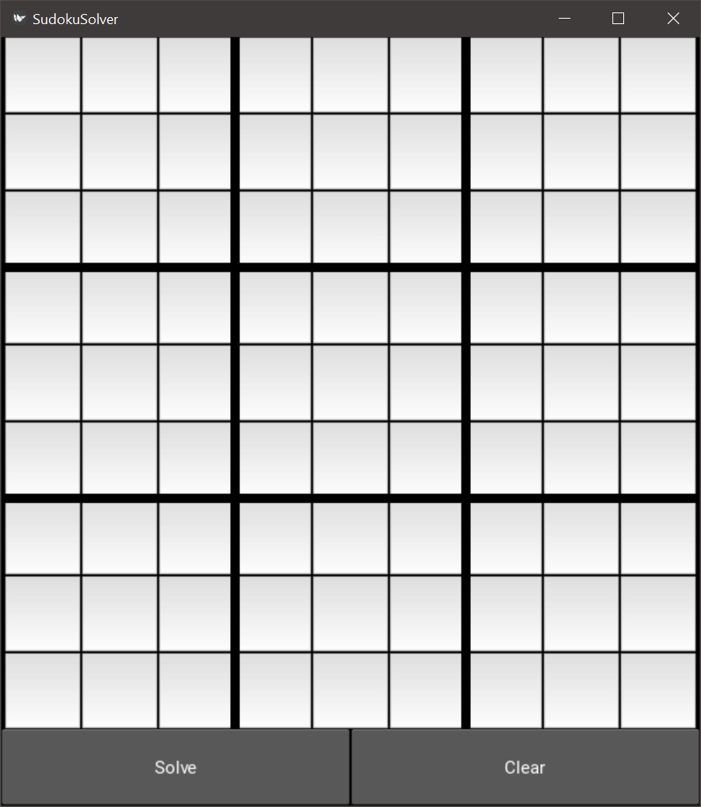
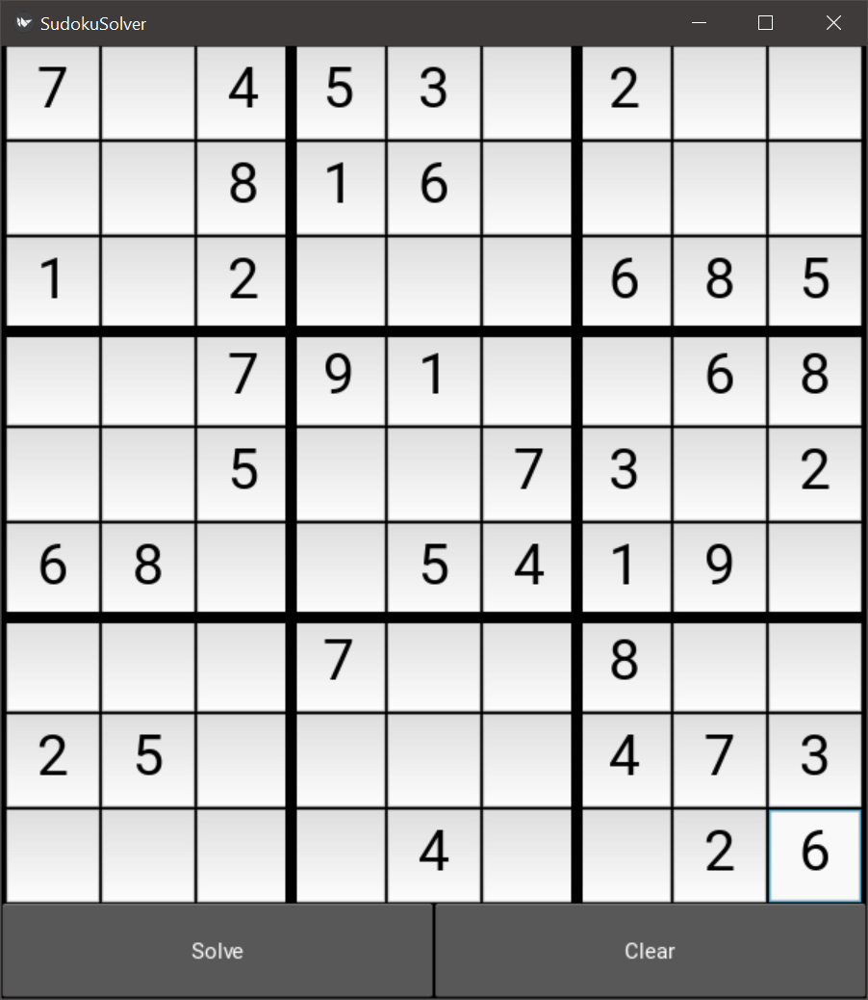
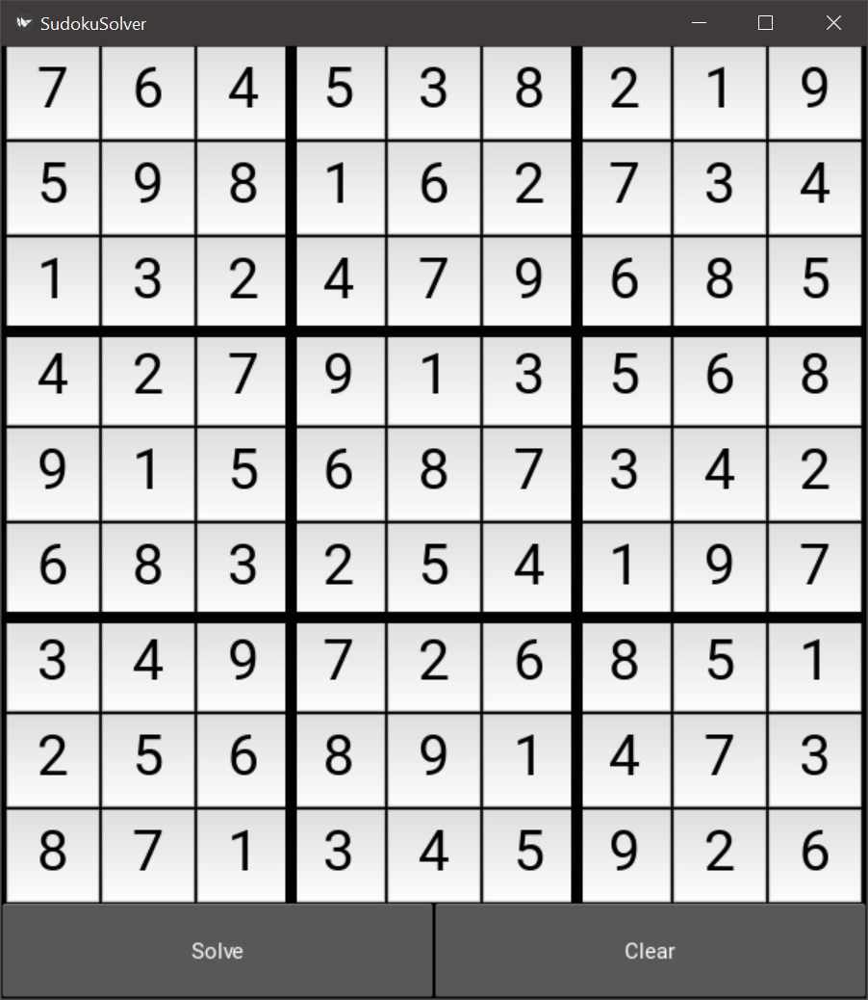
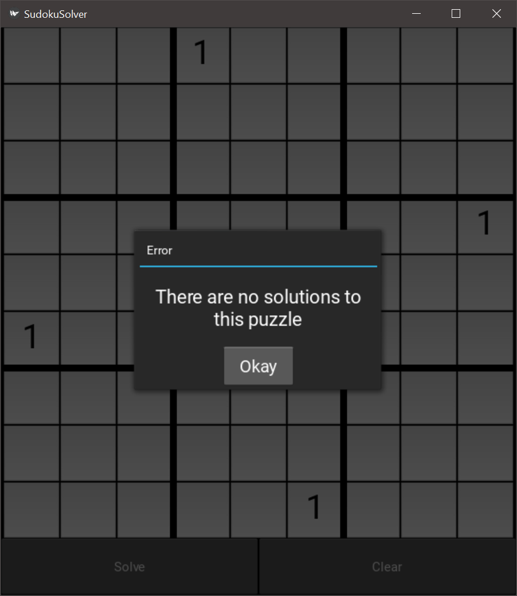

This is a program that can solve any valid sudoku puzzle. It is written in Python and uses the Kivy framework for the GUI.

A typical sudoku puzzle has only one solution and this program will find it. However, it is possible to give the program a puzzle that has multiple solutions. In this case, the program will stop at the first solution it finds and display it to you. Finally, it is possible to give the program a puzzle that does not have any solutions. In this case, the program will notify you that no solutions exist and leave the puzzle as you input it.

## Algorithms

This program uses a couple of different algorithms to solve the puzzle.

### Elimination

If a cell's neighbors (cells in the same row, column, or square) have known values, we can eliminate those values from that cell's possibilities list.
Unique Possibility

If a possibility occurs only once in any dimension (row, column, or square), then that must be the value for the cell that it is in.

### Subsets

Typically referred to by the sudoku community as naked pairs/triplets/etc, if a group of neighbor cells all have the same possibilities and the number of possibilities is the same as the number of members of the group, then we know that those numbers must go into the cells of the group. We can therefore remove those possibilities from the rest of the neighbors not in the group.

### Backtracking Brute-Force

Most easy and medium difficulty puzzles and many hard difficulty puzzles can be solved with the above algorithms, but as the puzzles get harder, these algorithms are not enough to solve the entire puzzle. Rather than resort to more and more complex algorithms that may or may not lead us to the solution, we can brute-force our way to the answer.

However, a simple brute-force approach to the problem is inefficient, so we instead use a backtracking algorithm that checks at each step to see if the current state of the board is valid, and if not, it stops searching that branch of the tree.

The backtracking algorithm is able to solve any puzzle on its own without the previous algorithms, but using the above algorithms, we are able to reduce the size of the problem much more quickly, so we use the first three algorithms until they fail, and only then do we start brute-forcing the answer.
